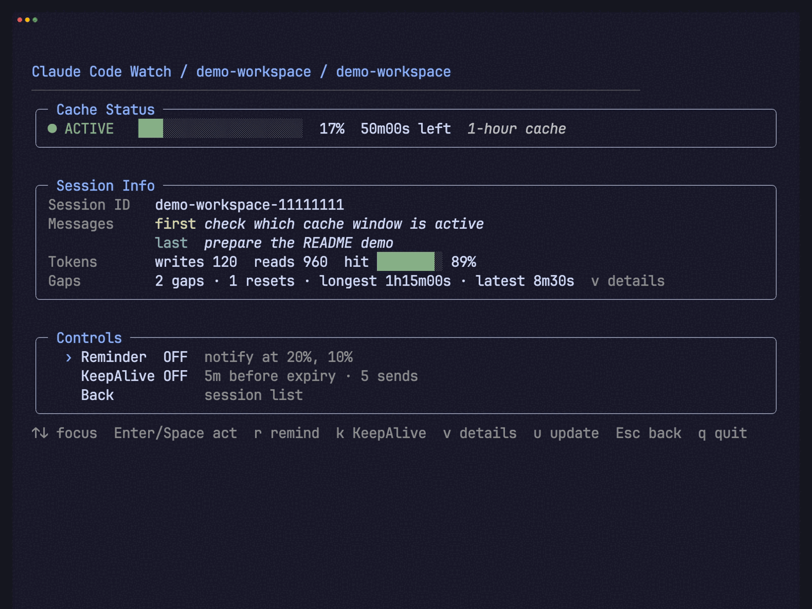

# cc-watch

Monitor your Claude Code sessions' cache status. Get a native macOS notification
before a cache window expires, keep a selected session warm with an automated
KeepAlive process, or show cache timing in your Claude Code statusline.

`cc-watch` is a macOS TUI for monitoring Claude Code session cache state from
the local session history. It lists recent projects, gives each session a
cache estimate, and shows the message and gap history behind that estimate.

The estimate is based on local transcript evidence. `cc-watch` does not read
Claude's server-side cache directly. When the evidence is insufficient, it
reports **Unknown** and disables features that depend on cache timing.

> **Local by default**
>
> `cc-watch` runs in the foreground, reads Claude Code's local JSONL history,
> makes no network requests, and does not rewrite transcripts. Reminders use
> native macOS notifications. KeepAlive is the one feature that can invoke
> your local `claude` command, and it is visible, cancellable, confirmed from
> the session file, and capped per session.

> **Beta:** `v1.0.0-beta.4`. Claude Code's transcript format and statusline
> hook may change. KeepAlive and the statusline integration are beta features.

On launch, `cc-watch` lists recent sessions and their cache state. Open a
session to see its cache timing, recent message cache status, token statistics,
and mid-session gaps.


## What it does

- **Session list.** Recent projects, short IDs, message excerpts, cache state,
  cache tier, hit rate, and Reminder or KeepAlive state. The list refreshes
  when Claude Code changes its session files.
- **Session details.** Active, expired, or unknown cache timing, recent message
  cache status, token statistics, and gaps longer than one minute. Full cache
  resets are separated from ordinary pauses.
- **Reminder.** A native macOS notification as the selected session approaches
  its configured threshold. It never sends a Claude message.
- **KeepAlive.** An optional, bounded process for keeping one selected session
  warm while you are away.
- **Claude Code statusline.** Usage, cache timing, and KeepAlive warnings
  alongside the statusline you already use.

## Install

`cc-watch` runs on macOS only.

### Homebrew

```bash
brew install rcverse/cc-watch/cc-watch
cc-watch
```

### From source

You need macOS and Go 1.23 or newer:

```bash
git clone https://github.com/rcverse/cc-watch.git
cd cc-watch
./install.sh --yes
cc-watch
```

The source installer puts the command at `~/.local/bin/cc-watch`. Add that
directory to your `PATH` if your shell cannot find it.

## The cache estimate

Claude Code's prompt cache is server-side. `cc-watch` works with the evidence
available in the local transcript:

- it anchors timing to an assistant response with positive output and cache
  token evidence;
- it shows **Active**, **Expired**, or **Unknown**;
- it treats a known cache tier as a window with a countdown;
- it does not let a user message, tool-only event, local command, or error
  refresh the estimate on timestamp alone;
- it clears the local estimate after events that can change the cached prompt
  prefix, including `/compact`, `/model`, `/reload-plugins`, and `/effort`.

When the transcript cannot support a safe timing claim, Reminder and KeepAlive
stay off until a later Claude Code response provides fresh evidence.

For the server-side background, see [Claude Code's prompt caching
documentation](https://code.claude.com/docs/en/prompt-caching).

## Reminder

Reminder sends a native macOS notification for a selected session when its
remaining cache percentage crosses a configured threshold. The default
thresholds are `20%` and `10%`.

The notification stays on your Mac. Reminder does not call Claude Code, alter
the session, or keep a background daemon running. It only runs while the
session has known, unexpired timing.

## KeepAlive

KeepAlive keeps one selected session warm while you are away. It handles one
session at a time, uses one configured message, shows a countdown, and enforces
a per-session send limit.



The demo shows the countdown, the configured message sent through Claude Code,
JSONL confirmation, and the refreshed cache estimate.

When armed, `cc-watch`:

1. waits until the configured point before expiry, with a safety margin for the
   cache tier;
2. shows a countdown that you can cancel or send immediately;
3. invokes the local `claude` command with the selected session and message;
4. watches the session JSONL for confirmation, then refreshes the cache
   estimate from the newly observed transcript.

A failed send, timeout, missing confirmation, or reached limit pauses the
workflow. It does not retry forever in the background. The default message is
`Keep-alive check. Reply "yes" only.` and the default limit is five sends per
session.

KeepAlive uses normal Claude Code usage and may incur normal costs. It is for
preserving a working session, not for starting a new task unattended.

## Claude Code statusline

The optional statusline integration adds cc-watch information to the command
you already use. It can show:

| Element               | Example                            |
| --------------------- | ---------------------------------- |
| **Usage**             | `⏱ 34% (5h) / 41% (7d) used`       |
| **KeepAlive warning** | `✓ KA OK` or `⚠ KeepAlive at risk` |
| **Cache timing**      | `⌛ 32m41s left · 1h cache`         |

Each element can be enabled, formatted, placed on the same line or a new
line, and ordered independently. Installation preserves the existing
statusline command and creates a timestamped backup before changing
`~/.claude/settings.json`.

Inspect the current wiring without changing it:

```bash
cc-watch statusline --check
```

The statusline hook always exits successfully. An existing wrapped command is
limited to five seconds so a slow helper does not stall Claude Code's UI.

## Commands

```text
cc-watch                         Open the session list.
cc-watch --id <partial-id>       Open a session by partial ID.
cc-watch config                  Edit Reminder, KeepAlive, and statusline settings.
cc-watch statusline              Render the configured statusline segment.
cc-watch statusline --check      Inspect statusline wiring without writing it.
cc-watch statusline --help       Show statusline-specific help.
cc-watch --help                  Show command help.
cc-watch --version               Show the installed version.
```

The TUI shows its current actions in the footer. Common actions are:

| Key     | Action                          |
| ------- | ------------------------------- |
| `Enter` | Open the selected session.      |
| `r`     | Toggle Reminder.                |
| `k`     | Arm or disarm KeepAlive.        |
| `u`     | Refresh the local session view. |
| `v`     | Expand session details.         |
| `c`     | Open Config.                    |
| `Esc`   | Go back.                        |
| `q`     | Quit.                           |

## Config

Run `cc-watch config` or open Config from the TUI. Settings are stored at
`~/.config/cc-watch/config.json`.

| Setting             |      Default | Controls                                   |
| ------------------- | -----------: | ------------------------------------------ |
| Recent sessions     |         `10` | How many sessions appear in the list.      |
| Reminder thresholds | `20%`, `10%` | When macOS notifications appear.           |
| KeepAlive trigger   |      `5 min` | How early the workflow prepares a send.    |
| Countdown           |     `30 sec` | The visible wait before an automatic send. |
| KeepAlive message   |    See above | The text sent through `claude`.            |
| Maximum sends       |          `5` | The per-session KeepAlive cap.             |

Saving a setting changes future behavior. It does not send a message or touch a
transcript.

## Where data lives

| Path                                | Access                                                                            |
| ----------------------------------- | --------------------------------------------------------------------------------- |
| `~/.claude/projects/**/*.jsonl`     | Read-only session history.                                                        |
| `~/.config/cc-watch/config.json`    | Reminder, KeepAlive, and statusline preferences.                                  |
| `~/.config/cc-watch/keepalive.log`  | Local record of KeepAlive sends and confirmations.                                |
| `~/.config/cc-watch/ratelimit.json` | Local state for statusline account-limit estimates.                               |
| `~/.claude/settings.json`           | Changed only when you explicitly install or uninstall the statusline integration. |

## Troubleshooting

**No sessions appear.** Open a Claude Code session first. The list is built
from JSONL history under `~/.claude/projects/`.

**Cache timing is unknown.** Send a normal Claude Code turn and refresh. If it
stays unknown, the transcript either contains a cache-reset event or lacks the
evidence needed for a safe estimate.

**Reminder is unavailable.** It needs a selected session with known,
unexpired timing. macOS may also need permission to show notifications for
your terminal.

**KeepAlive is paused.** Check that `claude` is available, the session still
has known timing, and its send limit has not been reached. Fix the issue, then
turn KeepAlive off and on again or reset its limit.

**Statusline output is missing.** Run `cc-watch statusline --check`, then send
one normal Claude Code message. Claude Code runs the hook during a turn, not
continuously while idle.

## Uninstall

If you installed the statusline integration, remove it from Config first. The
installer creates a backup before changing Claude Code settings.

Then remove the command:

```bash
brew uninstall cc-watch
```

This does not delete Claude Code transcripts. To remove preferences and local
logs, delete `~/.config/cc-watch/` yourself.

## For contributors

The project is a macOS-only Go application. The main checks are:

```bash
go build ./...
go vet ./...
go test ./...
go test -tags demo ./...
```

The demo fixtures use synthetic sessions and fake clocks. They never read your
real Claude Code projects or invoke a real KeepAlive send.

## License

MIT. See [LICENSE](LICENSE).
